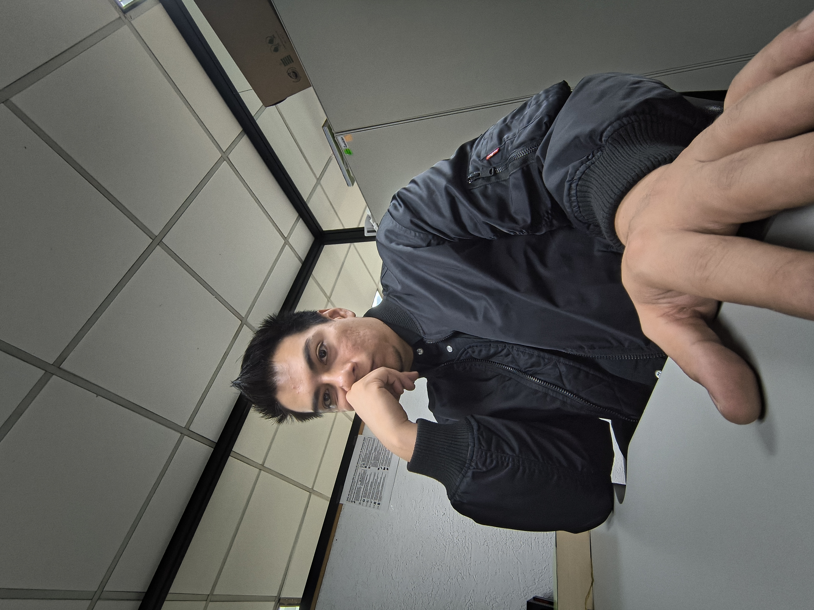

:::{.grid}

:::{.g-col-12 .g-col-md-4}
{.img-fluid .rounded aria-label="Fotografía profesional de Javier Arturo Paredes Tenorio"}

**Contacto:**  
[inktenorio@gmail.com](mailto:inktenorio@gmail.com)  
[GitHub (`tengorio`)](https://github.com/tengorio)
:::

:::{.g-col-12 .g-col-md-8}
Físico y especialista en estadística aplicada con experiencia en el sector público federal y privado. Mi trabajo se centra en diseñar modelos predictivos y estadísticos rigurosos, y construir las herramientas tecnológicas que los ponen a operar en producción.
:::

:::

---

## Trayectoria Profesional

### **Analista Especializado / Científico de Datos**
**Secretaría de Ciencia, Humanidades, Tecnología e Innovación (Secihti, antes Conahcyt)**  
*Enero 2025 – Presente | Dirección de Investigación Científica Básica y de Frontera*

- Diseñé e implementé el algoritmo **APEES** (*Scaled Prioritization with Social Equity*), asignando **$336,497,131 MXN** en fondos públicos a través de 3,631 propuestas evaluadas. Sustituí la media aritmética por mediana recortada ($r_{ref} = 9.19$) y franja de indiferencia ($\delta = 0.05$), reordenando 154 proyectos bajo criterios de equidad social.
- Formulé e implementé un modelo **Bayesiano Jerárquico Beta-Binomial** con contracción parcial (*shrinkage*) y aditividad tipo Ley de Hess para simular cuellos de botella y tiempos de tramitación administrativa en $N = 484$ proyectos a través de 4 rutas operativas y teoría de colas ($M/M/k$).
- Redacté el manuscrito científico *"Designing Auditable Priority Mechanisms for Public Research Funding: Merit, Equity, and the APEES Algorithm"* (en preparación para *Science and Public Policy*, Oxford University Press), formalizando el tratamiento de la franja crítica ($\mathcal{F}$) ante las Condiciones de Imposibilidad de Arrow.
- Diseñé la arquitectura de **tableros de control desacoplados** (Vanilla JS/CSS, Python updater, consultas SQL multiasociativas en MySQL/PostgreSQL) para monitoreo en vivo de convocatorias masivas.

### **Analista Especializado**
**Conahcyt**  
*Agosto 2024 – Diciembre 2024 | Dirección de Ciencia de Frontera*

- Diseñé un pipeline ETL e integración de OCR (**EasyOCR** y **Azure API**) para la auditoría documental de **~760 proyectos** (fondo CB-2017-2018) y **363 PDFs** de oficios. Formulé un discriminante de distancia absoluta ($disc\_v1$) con límites IQR para reconciliación de entregables y dictámenes.
- Desarrollé un algoritmo en Python para la extracción automatizada de DOI y validación de metadatos mediante la API de **Crossref**, automatizando la auditoría de artículos científicos comprometidos.
- Construí una aplicación desktop GUI en Python/Tkinter (**`fusionador`**, ejecutable `.exe` de ~25 MB) para indización con patrones Regex y corrección de paridad de páginas para impresión dúplex de expedientes PDF.

### **Data Science Analyst**
**Jüsto (Supermercado Digital)**  
*Marzo 2024 – Agosto 2024 | Ciudad de México*

- Reasignación estratégica de zonas de reparto e infraestructura logística de última milla utilizando la API de ArcGIS en Python.
- Clusterización de clientes según perfil de compra mediante K-Means y Análisis de Componentes Principales (PCA).
- Construcción de un índice cuantitativo para la identificación y prevención de productos propensos a agotarse (*Never Stock Out*).

### **Participaciones Destacadas**
- **Impact Lab de Claude (Anthropic):** Participación en el laboratorio de desarrollo e investigación analítica con modelos de lenguaje y herramientas avanzadas de Inteligencia Artificial.

---

## Docencia Universitaria

### **Profesor y Profesor Adjunto**
**Facultad de Ciencias, UNAM** — *Enero 2019 – Junio 2025*

- **Departamento de Matemáticas:** Cálculo Diferencial e Integral I (Semestres 2024-1, 2023-1, 2021-2), Cálculo II (Semestres 2023-2, 2022-1, 2021-3), Cálculo III (Semestres 2022-2, 2020-2) y Cálculo IV (Semestre 2021-1).
- **Departamento de Física:** Termodinámica (Semestres 2025-2, 2025-1), Fenómenos Colectivos (Semestres 2024-2, 2024-1, 2023-3, 2023-2, 2023-1), Laboratorio de Mecánica (Semestre 2022-2) y Laboratorio de Electromagnetismo (Semestre 2019-1).

### **Programa Adopte Un Talento (PAUTA)**
*Julio 2023 – Agosto 2023*  
- Impartición de talleres de formación científica para estudiantes de alto desempeño.

---

## Formación Académica

- **Especialización en Estadística Aplicada**  
  *Instituto de Investigaciones en Matemáticas Aplicadas y en Sistemas (IIMAS), UNAM* (Agosto 2023 – Mayo 2024).  
  *Titulado por Examen General de Conocimientos.*
- **Licenciatura en Física**  
  *Facultad de Ciencias, UNAM* (Agosto 2015 – Agosto 2021).  
  *Tesis:* "Desarrollo de un espectrómetro didáctico de fotoemisión y Raman para caracterizar matlanina". Presentada en el LXI Congreso Nacional de Física y en la XIII Reunión Anual de la AAPT-MX.

---

## Competencias y Stack Tecnológico

- **Estadística y Ciencia de Datos:** Preprocesamiento y Análisis Exploratorio (EDA), Análisis Geoestadístico (SIG/QGIS/ArcGIS), Modelos de Regresión Generalizados (GLM), Análisis de Supervivencia, Inferencia Bayesiana, PCA, Clustering (K-Means, LDA, MDA).
- **Herramientas e Informática:** Python (`pandas`, `scikit-learn`, `Streamlit`, `NumPy`, `SciPy`), R, SQL, LaTeX, Quarto, Git, Microsoft Office Avanzado.
- **Idiomas:** Español (Nativo), Inglés (C1 Avanzado), Alemán (A2 Básico).
